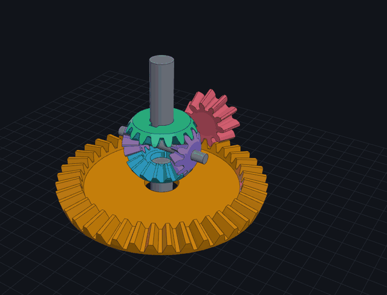
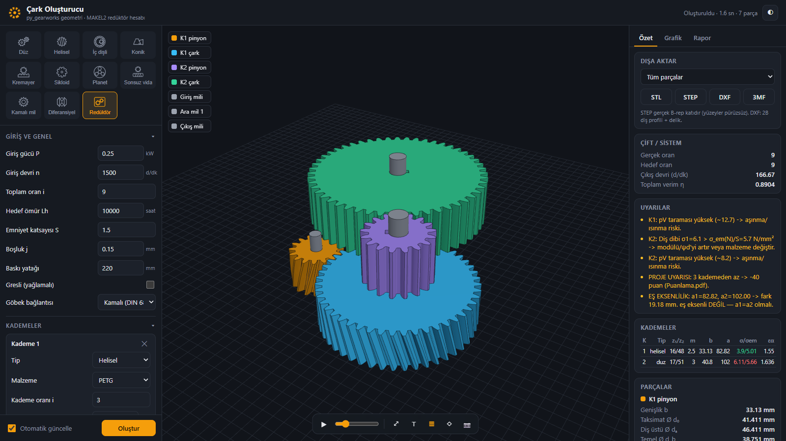
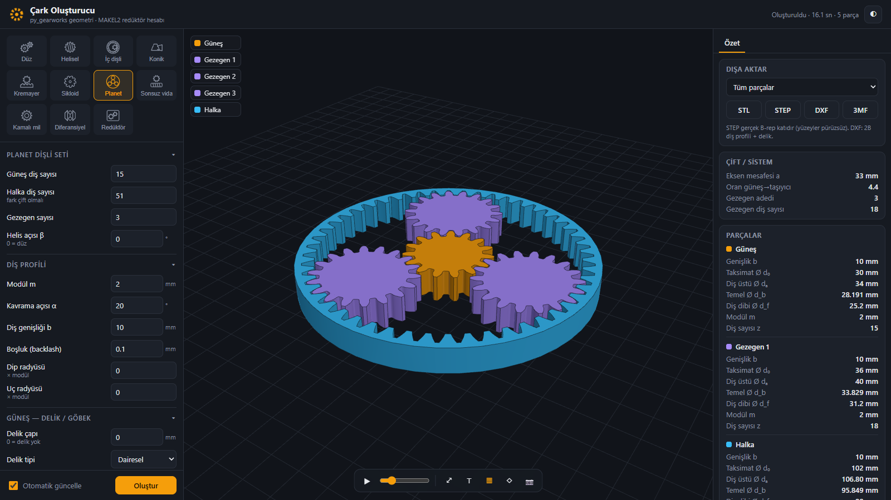
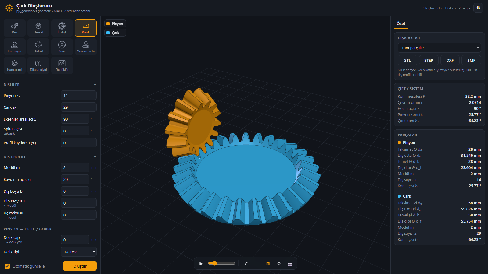
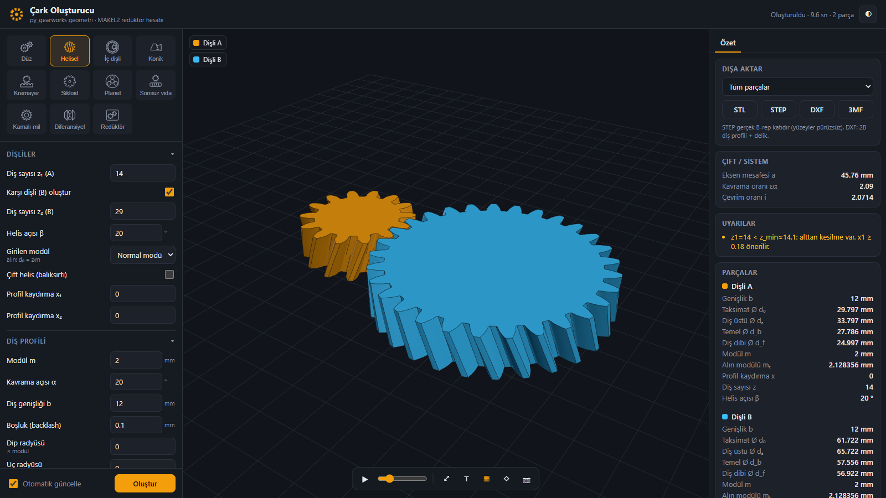
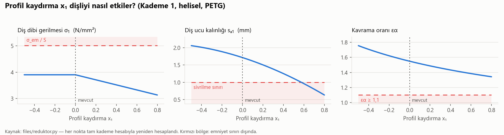

# Gear & Drivetrain Design Tool

Generates gear geometry and supports the design and simulation of gear systems such as
reducers and differentials.

🇹🇷 [Türkçe sürüm](README.md)



A local web app. You set the gear parameters on the left and get a real 3D CAD model in the
middle. You can animate it, check the dimensions and engineering warnings on the right, and
export it to **STEP / STL / DXF / 3MF** for CAD or 3D printing. In reducer mode you enter
power, speed and the target ratio. The app sizes every stage with gear-strength formulas and
builds the full assembly with shafts and keyed bores.

> 📘 **New here? → [Step-by-step tutorial](docs/TUTORIAL.en.md)** (5 minutes, with screenshots)

> The user interface is in Turkish (it was built for a Machine Elements course).
> The tutorial includes a small TR → EN glossary.

---

## What it can do

| | |
|---|---|
|  |  |
| **Reducer design.** Power, rpm and ratio go in. Module, face width, shafts and keyed bores come out, along with a full calculation report. | **Planetary gear set.** Sun, planets and ring gear. The planet carrier rotates in the animation. |
|  |  |
| **Bevel gears** with any shaft angle Σ. | **Helical / herringbone gears** with profile shift and backlash. |

**Gear types:** spur · helical · herringbone · internal (ring) · bevel · rack & pinion ·
cycloidal · planetary · worm (approximate) · involute spline shaft + hub ·
**differential** · **multi-stage reducer**

**Per-gear features:** bore (round, DIN 6885 keyway, D-flat, hexagon), hub, root and tip
fillets, undercut, profile shift, backlash.

## Sensitivity charts

In reducer mode a **Grafik** (chart) tab sweeps one parameter of a stage. Every point is
recalculated with `reduktor.py` and plotted against its safety limit:



More profile shift lowers the root stress, but beyond x₁ ≈ 0.57 the tooth tip becomes too
thin. The chart shows that trade-off at a glance. In the app you can hover over the curves
and view the data as a table. The README images are generated from the same function by
[`docs/grafik_uret.py`](docs/grafik_uret.py).

## Engineering inside

- **Strength calculation** (Machine Elements course method, Akkurt / DIN): tooth-root
  bending and surface (Hertz) pressure, standard module selection (DIN 780), life factor
  from load cycles, contact ratio εα / εβ / εγ, tip thickness check, efficiency and
  hunting-tooth check.
- **Shafts & bearings:** equivalent bending moment, shaft diameter from strength *and*
  stiffness (deflection and slope limits), DIN 6885 key pressure, ball bearing selection
  with L10h life.
- **Design search:** scans ratio splits, tooth counts and helix angles to find the most
  compact, the most efficient or a coaxial reducer.
- **Kinematics:** every gear's angular velocity comes from equal surface speed at the pitch
  point. This works for parallel, internal and bevel meshes. Each mode was verified
  numerically: the parts are rotated by their animation ratios and the CAD intersection
  volume between meshing gears is checked to stay at **zero**.
- **Differential:** ring and drive pinion, two side gears, 2 or 4 spider gears. A *turn*
  slider sets the left/right wheel speed difference. The side gears turn at
  ω·(1 ± Δ) and the spiders spin on the cross pin.
- **Collision-free assembly:** each reducer stage is mounted on the previous stage's output
  shaft. The angle around the shaft and the axial offset are picked automatically so that
  nothing overlaps (Monte-Carlo test on cylinder proxies).

## Quick start

Requirements: Python 3.10+ (tested on 3.13), Windows / Linux / macOS.

```bash
git clone https://github.com/<your-username>/gear-drivetrain-design-tool.git
cd gear-drivetrain-design-tool
pip install -r requirements.txt
python uygulama/app.py
```

Your browser opens **http://127.0.0.1:5050**. On Windows you can also double-click
**`baslat.bat`**; it installs the packages the first time.

Handy links: `?tip=diferansiyel`, `?tip=reduktor`, `?tip=planet&oynat=1` open a mode directly
(`oynat=1` starts the animation).

## How it works


1. The browser sends the parameters. The server builds exact B-rep solids with
   **py_gearworks** on top of **build123d / OpenCascade**.
2. In reducer mode, **`reduktor.py`** first sizes each stage (module, face width, shaft
   diameters, keys, bearings). The engine then turns those numbers into gears, shafts and
   keyed bores and places them without collisions.
3. Each part comes back as a triangle mesh plus its rotation axis and speed ratio. The
   **three.js** viewer animates them.
4. Exports are produced from the original CAD solids, so a STEP file has true smooth
   surfaces, not triangles.

## Project structure

```
uygulama/            web app
  app.py             Flask server (build, export, report, design search endpoints)
  motor.py           geometry engine: gear types, differential, reducer assembly, export
  static/            UI: index.html, app.js (three.js viewer), style.css
files/reduktor.py    reducer strength calculation (also has its own Tkinter GUI)
files/stl_to_step.py dependency-free STL → STEP converter
mil_spline.py        standalone involute spline shaft profile → DXF / SVG
vendor/py_gearworks  gear geometry library (Apache-2.0, see credits)
docs/                tutorial and images
```

## Notes & limitations

- The worm drive is modelled as a crossed helical pair (py_gearworks has no true worm
  geometry yet). It is good for visualisation, not for manufacturing the worm wheel.
- In `py_gearworks` the rack & pinion meshing can place the pinion in the wrong tooth
  phase. The engine fixes this by rotating the pinion to the zero-overlap angle.
- The strength formulas follow the course method. Values tagged `[DIN/tahmini]` in the
  report are estimates and should be checked against the standard before real use.

## Credits

- **[py_gearworks](https://github.com/GarryBGoode/py_gearworks)** by Gergely Bencsik:
  gear geometry generation (Apache-2.0, bundled in `vendor/py_gearworks` with its license).
- **[build123d](https://github.com/gumyr/build123d)** / OpenCascade: CAD kernel.
- **[three.js](https://threejs.org)**: 3D viewer (MIT).

Reducer calculations, the web app, the differential and reducer assembly logic, the
kinematics and the integration were written for this project.
