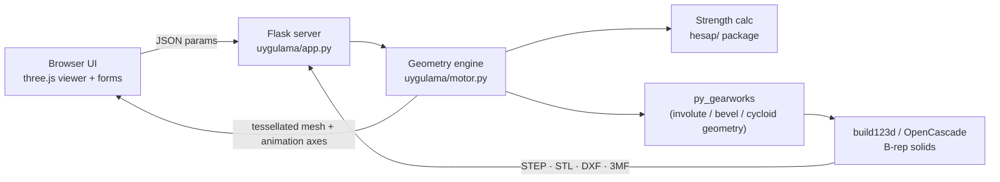

# Gear & Drivetrain Design Tool

[](https://github.com/HCE-Engineer/gear-drivetrain-design-tool/actions/workflows/testler.yml)


Generates gear geometry and supports the design and simulation of gear systems such as
reducers and differentials.

🇹🇷 [Türkçe sürüm](README.md)


A local web app. You set the gear parameters on the left and get a real 3D CAD model in the
middle. You can animate it, check the dimensions and engineering warnings on the right, and
export it to **STEP / STL / DXF / 3MF** for CAD or 3D printing. In reducer mode you enter
power, speed and the target ratio. The app sizes every stage with gear-strength formulas and
builds the full assembly with shafts and keyed bores.

> 📘 **New here? → [Step-by-step tutorial](docs/TUTORIAL.en.md)** (5 minutes, with screenshots)

> The user interface is in Turkish (it was built for a Machine Elements course).
> The tutorial includes a small TR → EN glossary.

---

## What it can do

| | |
|---|---|
|  |  |
| **Reducer design.** Power, rpm and ratio go in. Module, face width, shafts and keyed bores come out, along with a full calculation report. | **Planetary gear set.** Sun, planets and ring gear. The planet carrier rotates in the animation. |
|  |  |
| **Bevel gears** with any shaft angle Σ. | **Helical / herringbone gears** with profile shift and backlash. |

**Gear types:** spur · helical · herringbone · internal (ring) · bevel · rack & pinion ·
cycloidal · planetary · worm (approximate) · involute spline shaft + hub ·
**differential** · **multi-stage reducer**

**Per-gear features:** bore (round, DIN 6885 keyway, D-flat, hexagon), hub, root and tip
fillets, undercut, profile shift, backlash.

## Sensitivity charts

In reducer mode a **Grafik** (chart) tab sweeps one parameter of a stage. Every point is
recalculated with the `hesap/` package and plotted against its safety limit:


More profile shift lowers the root stress, but beyond x₁ ≈ 0.67 the tooth tip becomes too
thin (with tip shortening applied). The chart shows that trade-off at a glance. In the app you can hover over the curves
and view the data as a table. The README images are generated from the same function by
[`docs/grafik_uret.py`](docs/grafik_uret.py).

## Engineering inside

- **Strength calculation** (Akkurt, *Makina Elemanları Vol. II* method + DIN):
  tooth-root bending and surface (Hertz) pressure, standard module selection (DIN 780).
  The allowable stress σ_em·Y_N/S is the **same** in sizing and in the check, and pinion
  and wheel are checked separately (each with its own form factor and load cycles).
  Also: life factor, working center distance and **tip shortening** for profile-shifted
  pairs, contact ratio εα / εβ / εγ, tip thickness, efficiency and hunting-tooth check.
- **Shafts & bearings:** equivalent bending moment, shaft diameter from strength *and*
  stiffness (deflection and slope limits), DIN 6885 key pressure, ball bearing selection
  with L10h life.
- **Design search:** scans ratio splits, tooth counts and helix angles to find the most
  compact, the most efficient or a coaxial reducer.
- **Kinematics:** every gear's angular velocity comes from equal surface speed at the pitch
  point. This works for parallel, internal and bevel meshes. Each mode was verified
  numerically: the parts are rotated by their animation ratios and the CAD intersection
  volume between meshing gears is checked to stay at **zero**.
- **Differential:** ring and drive pinion, two side gears, 2 or 4 spider gears. A *turn*
  slider sets the left/right wheel speed difference. The side gears turn at
  ω·(1 ± Δ) and the spiders spin on the cross pin.
- **Collision-free assembly:** each reducer stage is mounted on the previous stage's output
  shaft. The angle around the shaft and the axial offset are picked automatically so that
  nothing overlaps (Monte-Carlo test on cylinder proxies).

## Tests

More than 60 `pytest` tests run on every push via GitHub Actions:

- **Textbook / hand-calculation examples:** a solved straight bevel gear example
  (δ01 = 12.53°, mean module 5.535 mm, Ft = 1412.1 N, Fa = 111.5 N, Fr = 501.7 N) and
  εα = 1.671 for a 20/60 pair.
- **Consistency:** in 36 power / speed / ratio / material combinations the sized gear passes
  its own pinion *and* wheel check; tip shortening keeps the root clearance at 0.25·m.
- **Kinematics:** for spur, helical, internal, bevel, rack and the differential, the CAD
  intersection volume between meshing gears stays zero when rotated by the animation
  ratios, and becomes non-zero when one gear is rotated the wrong way.
- **Export:** STEP / STL / DXF files are produced and the DXF profile lies in the XY plane.

```bash
pip install pytest
python -m pytest
```

## Quick start

Requirements: Python 3.10+ (tested on 3.13), Windows / Linux / macOS.

```bash
git clone https://github.com/HCE-Engineer/gear-drivetrain-design-tool.git
cd gear-drivetrain-design-tool
pip install -r requirements.txt
python uygulama/app.py
```

Your browser opens **http://127.0.0.1:5050**. On Windows you can also double-click
**`baslat.bat`**; it installs the packages the first time.

Handy links: `?tip=diferansiyel`, `?tip=reduktor`, `?tip=planet&oynat=1` open a mode directly
(`oynat=1` starts the animation).

## How it works



1. The browser sends the parameters. The server builds exact B-rep solids with
   **py_gearworks** on top of **build123d / OpenCascade**.
2. In reducer mode, the **`hesap/`** package first sizes each stage (module, face width, shaft
   diameters, keys, bearings). The engine then turns those numbers into gears, shafts and
   keyed bores and places them without collisions.
3. Each part comes back as a triangle mesh plus its rotation axis and speed ratio. The
   **three.js** viewer animates them.
4. Exports are produced from the original CAD solids, so a STEP file has true smooth
   surfaces, not triangles.

## Project structure

```
hesap/               strength calculation core (pure Python, no CAD dependency)
  disli.py           stage calculations: spur / helical, bevel, worm
  mil.py, rulman.py  shaft sizing (strength + deflection/slope), bearing selection
  reduktor.py        the whole chain: calc_reducer(cfg)
  arama.py, rapor.py design search, sensitivity sweep, text report
uygulama/            web app
  app.py             Flask server (build, export, report, search, chart endpoints)
  motor.py           geometry engine: gear types, differential, reducer assembly
  static/            UI: index.html, app.js (three.js viewer + SVG charts), style.css
tests/               pytest tests (calculation + 3D geometry / kinematics)
legacy/              first version: Tkinter desktop UI, CLI, OpenSCAD export
araclar/             standalone tools: spline shaft profile → DXF/SVG, STL → STEP
vendor/py_gearworks  gear geometry library (Apache-2.0, see credits)
docs/                tutorial, images and chart script
```

## Notes & limitations

- The worm drive is modelled as a crossed helical pair (py_gearworks has no true worm
  geometry yet). It is good for visualisation, not for manufacturing the worm wheel.
- In `py_gearworks` the rack & pinion meshing can place the pinion in the wrong tooth
  phase. The engine fixes this by rotating the pinion to the zero-overlap angle.
- The strength calculation follows the classic Akkurt method; it has not yet been
  compared one-to-one with ISO 6336 / DIN 3990 (or tools such as KISSsoft). Values tagged
  `[DIN/tahmini]` in the report are estimates and should be checked against the standard
  before real use.
- The tooth-root form factor Kf uses an approximate fit of Akkurt's chart.
- Bearing selection only uses deep-groove ball bearings; tapered roller bearings for the
  axial load of bevel stages are not implemented yet, nor is the bevel surface-pressure
  check.

## Credits

- **[py_gearworks](https://github.com/GarryBGoode/py_gearworks)** by Gergely Bencsik:
  gear geometry generation (Apache-2.0, bundled in `vendor/py_gearworks` with its license).
- **[build123d](https://github.com/gumyr/build123d)** / OpenCascade: CAD kernel.
- **[three.js](https://threejs.org)**: 3D viewer (MIT).

Reducer calculations, the web app, the differential and reducer assembly logic, the
kinematics and the integration were written for this project.

## License

The code of this project is released under the [MIT license](LICENSE).
`vendor/py_gearworks` keeps its own Apache-2.0 license.
