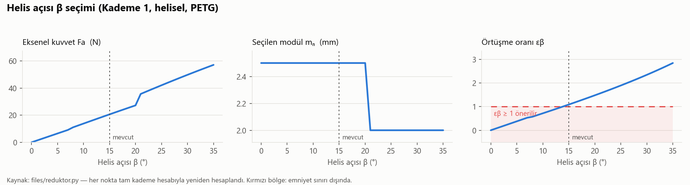
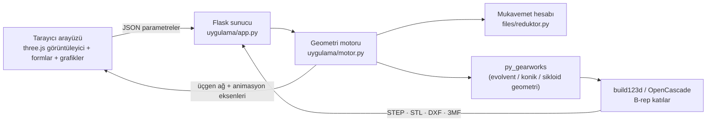

# Gear & Drivetrain Design Tool

Dişli geometrisi üretir; redüktör ve diferansiyel gibi dişli sistemlerinin tasarımını ve
simülasyonunu destekler.

🇬🇧 [English version](README.en.md)


Bilgisayarda çalışan bir web uygulaması:
- Solda dişli parametrelerini girersin, ortada gerçek bir **3B CAD modeli** oluşur.
- Modeli döndürüp animasyonla çalıştırabilirsin. Ölçüler, mühendislik uyarıları ve
  grafikler sağ panelde görünür.
- Sonucu CAD programları veya 3B yazıcı için **STEP / STL / DXF / 3MF** olarak indirirsin.

Redüktör modunda yalnızca **güç, devir ve hedef oranı** girersin. Program her kademeyi
dişli mukavemet hesabıyla boyutlandırır, mil ve kamalı göbek delikleriyle birlikte bütün
montajı kurar.

> 📘 **Nasıl kullanılır? → [Adım adım tutorial](docs/TUTORIAL.md)** (5 dakika, ekran görüntülü)

---

## Neler yapabiliyor

| | |
|---|---|
|  |  |
| **Redüktör tasarımı.** Güç, devir ve oran girilir. Modül, diş genişliği, miller, kamalı delikler ve tam hesap raporu çıkar. | **Planet dişli seti.** Güneş, gezegenler ve halka. Taşıyıcının dönüşü animasyonda görünür. |
|  |  |
| **Konik dişliler**, istenen eksen açısı Σ ile. | **Helisel / balıksırtı dişliler**, profil kaydırma ve boşluk ile. |

**Dişli tipleri:** düz · helisel · balıksırtı · iç dişli (halka) · konik · kremayer ·
sikloid · planet · sonsuz vida (yaklaşık) · evolvent kamalı mil + göbek ·
**diferansiyel** · **çok kademeli redüktör**

**Her dişliye eklenebilenler:** delik (dairesel, DIN 6885 kamalı, D-kesit, altıgen), göbek,
dip ve uç radyüsü, alttan kesilme, profil kaydırma, boşluk (backlash).

## Duyarlılık grafikleri

Tasarımda tek bir parametreyi değiştirince dişlinin nasıl tepki verdiğini görmek için
redüktör modunda bir **Grafik** sekmesi var. Seçilen kademenin bir parametresi taranır. Her
nokta `reduktor.py` ile baştan hesaplanır ve sonuç emniyet sınırlarıyla birlikte çizilir:


Profil kaydırma x₁ artırıldığında diş dibi gerilmesi düşer, yani dişli güçlenir. Fakat
x₁ ≈ 0,57'den sonra diş ucu çok incelir ve sivrilme sınırının altına iner. İyi bir tasarım
bu iki sınır arasında kalmalıdır; grafik bu dengeyi bir bakışta gösteriyor.



Helis açısı β büyüdükçe dişler daha uzun süre temasta kalır (εβ artar), ama yataklara
binen eksenel kuvvet Fa da artar. β ≈ 13°'nin altında örtüşme oranı yetersiz kalır. β =
21°'de hesap daha küçük bir standart modüle geçer; Fa'daki sıçrama bu yüzdendir.

Aynı grafikleri uygulamada fareyle inceleyip tablo olarak da görebilirsin. README
görselleri [`docs/grafik_uret.py`](docs/grafik_uret.py) ile, uygulamadaki fonksiyonun
aynısından üretilir.

## Mühendislik tarafı

- **Mukavemet hesabı** (Makine Elemanları dersi yöntemi, Akkurt / DIN):
  - diş dibi eğilme ve yüzey (Hertz) basıncı, DIN 780 standart modül seçimi
  - çevrim sayısına bağlı ömür faktörü
  - kavrama oranları εα / εβ / εγ, diş ucu sivrilme kontrolü
  - verim ve asal diş (hunting) kontrolü
- **Mil ve rulman:**
  - eşdeğer moment ile mil çapı; hem mukavemet hem rijitlik (sehim ve eğim sınırı)
  - DIN 6885 kama basıncı
  - L10h ömrüyle bilyeli rulman seçimi
- **Tasarım arama motoru:** oran dağılımı, diş sayısı ve helis açısı kombinasyonlarını
  tarar. En kompakt, en verimli veya eş eksenli redüktörü bulur.
- **Kinematik:** her dişlinin açısal hızı, taksimat noktasında çevresel hızların eşit
  olmasından hesaplanır. Paralel, iç ve konik dişlilerde aynı formül çalışır. Her mod
  sayısal olarak doğrulandı: parçalar animasyon oranlarıyla döndürüldü ve kavrayan
  dişliler arasındaki CAD kesişim hacminin **sıfır** kaldığı kontrol edildi.
- **Diferansiyel:** ayna ve tahrik pinyonu, iki aks dişlisi, 2 veya 4 uydu dişlisi.
  *Viraj* ayarı sol ve sağ tekerlek arasındaki hız farkını belirler. Aks dişlileri
  ω·(1 ± Δ) hızla döner, uydular istavroz mili üzerinde kendi etrafında döner.
- **Çakışmasız montaj:** her redüktör kademesi bir önceki kademenin çıkış miline
  takılır. Mil etrafındaki açı ve eksenel mesafe, parçalar birbirine girmeyecek şekilde
  otomatik seçilir (silindir vekilleri üzerinde Monte-Carlo testi).

## Hızlı başlangıç

Gereksinim: Python 3.10+ (3.13 ile test edildi), Windows / Linux / macOS.

```bash
git clone https://github.com/<kullanici-adin>/gear-drivetrain-design-tool.git
cd gear-drivetrain-design-tool
pip install -r requirements.txt
python uygulama/app.py
```

Tarayıcıda **http://127.0.0.1:5050** açılır. Windows'ta **`baslat.bat`** dosyasına çift
tıklaman da yeterli; ilk seferde gerekli paketleri kendisi kurar.

Kısayol linkler: `?tip=diferansiyel`, `?tip=reduktor&sekme=grafik`, `?tip=planet&oynat=1`
ilgili modu doğrudan açar (`oynat=1` animasyonu başlatır).

## Nasıl çalışıyor



1. Tarayıcı parametreleri sunucuya gönderir. Sunucu **py_gearworks** ile, **build123d /
   OpenCascade** üzerinde gerçek B-rep katılar oluşturur.
2. Redüktör modunda önce **`reduktor.py`** her kademeyi boyutlandırır (modül, diş
   genişliği, mil çapları, kamalar, rulmanlar). Motor bu sayıları dişlilere, millere ve
   kamalı deliklere çevirir, sonra parçaları çakışmadan yerleştirir.
3. Her parça bir üçgen ağı, dönme ekseni ve hız oranıyla birlikte geri döner.
   **three.js** görüntüleyici bunları canlandırır.
4. Dışa aktarma orijinal CAD katısından yapılır. Bu yüzden STEP dosyasında yüzeyler
   üçgenli değil, pürüzsüzdür.

## Proje yapısı

```
uygulama/            web uygulaması
  app.py             Flask sunucu (oluşturma, dışa aktarma, rapor, arama, grafik uçları)
  motor.py           geometri motoru: dişli tipleri, diferansiyel, redüktör montajı, tarama
  static/            arayüz: index.html, app.js (three.js + SVG grafikler), style.css
files/reduktor.py    redüktör mukavemet hesabı (kendi Tkinter arayüzü de var)
files/stl_to_step.py bağımlılıksız STL → STEP dönüştürücü
mil_spline.py        bağımsız evolvent kamalı mil profili → DXF / SVG
vendor/py_gearworks  dişli geometri kütüphanesi (Apache-2.0, bkz. Kaynaklar)
docs/                tutorial, görseller ve grafik üretme betiği
```

## Notlar ve sınırlamalar

- Sonsuz vida, çapraz helisel dişli çifti olarak modellenir (py_gearworks'te henüz gerçek
  sonsuz vida geometrisi yok). Görselleştirme için uygundur, çark imalatı için değil.
- `py_gearworks`'ün kremayer eşleştirmesi pinyonu yanlış diş fazına koyabiliyor. Motor,
  pinyonu çakışmanın sıfır olduğu açıya döndürerek bunu düzeltir.
- Mukavemet formülleri ders yöntemini izler. Raporda `[DIN/tahmini]` diye işaretlenen
  değerler tahmindir; gerçek bir uygulamada standarda göre kontrol edilmelidir.

## Kaynaklar

- **[py_gearworks](https://github.com/GarryBGoode/py_gearworks)** (Gergely Bencsik):
  dişli geometrisi üretimi (Apache-2.0; lisansıyla birlikte `vendor/py_gearworks` içinde).
- **[build123d](https://github.com/gumyr/build123d)** / OpenCascade: CAD çekirdeği.
- **[three.js](https://threejs.org)**: 3B görüntüleyici (MIT).

Redüktör hesapları, web uygulaması, diferansiyel ve redüktör montaj mantığı, kinematik,
duyarlılık analizi ve entegrasyon bu proje için yazıldı.
