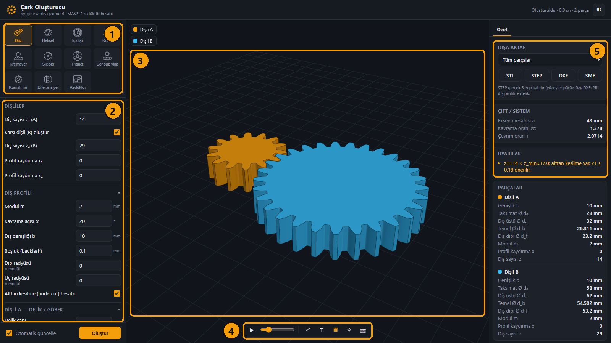
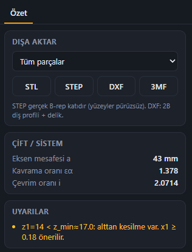
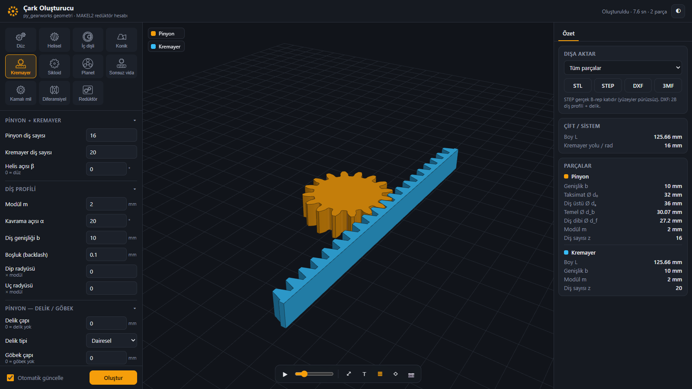
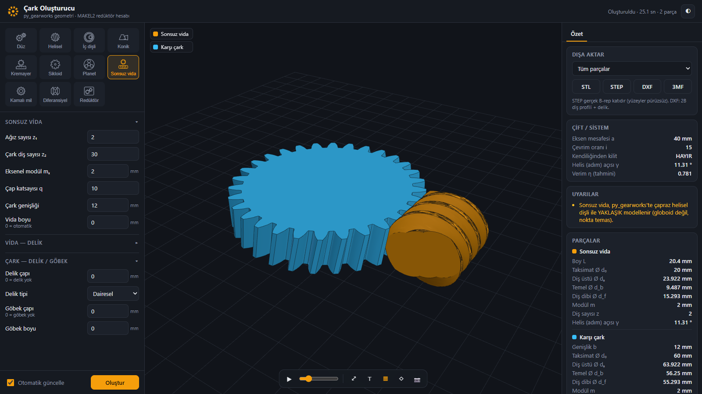
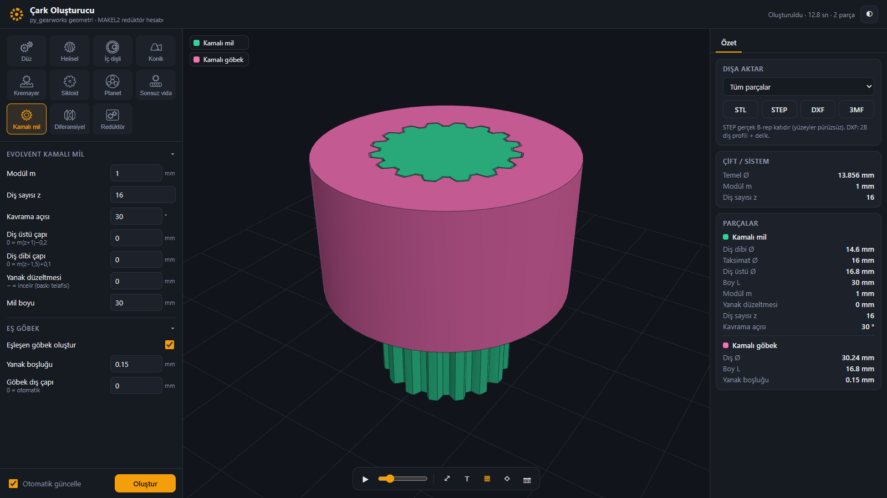
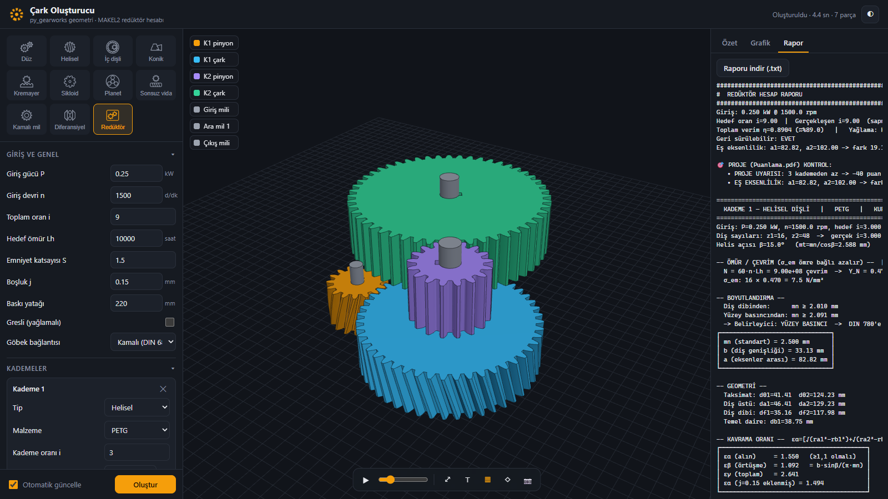
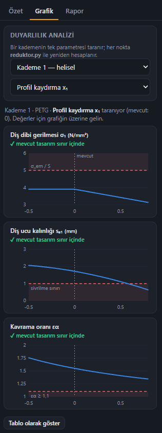
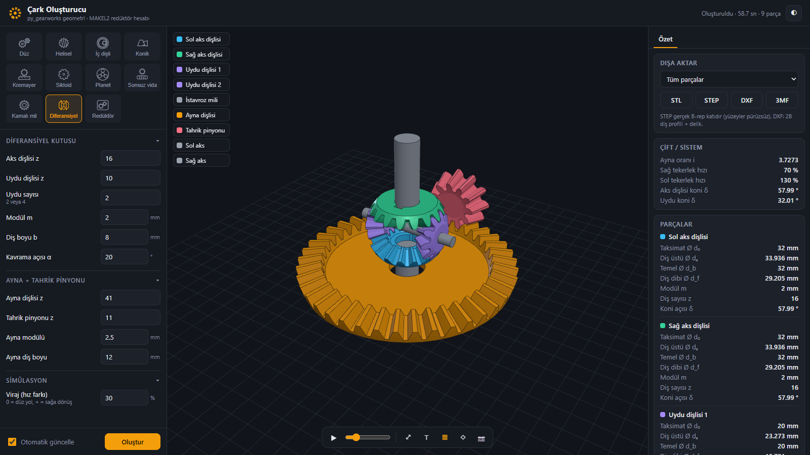

# Tutorial: 5 dakikada ilk dişlin

🇬🇧 [English version](TUTORIAL.en.md)

Bu rehber uygulamayı baştan sona gezdiriyor. Önce bir dişli çifti oluşturup sonuçları
okuyacak ve dışa aktaracaksın. Sonra tam bir redüktör tasarlayıp grafiklerine bakacak ve
bir diferansiyeli çalıştıracaksın.

## 0. Uygulamayı başlat

```bash
pip install -r requirements.txt
python uygulama/app.py
```

Windows'ta `baslat.bat` dosyasına çift tıklaman da yeterli. Tarayıcıda
`http://127.0.0.1:5050` açılır.

## 1. Ekranı tanı



| # | Alan | Ne işe yarar |
|---|---|---|
| **1** | Dişli tipi | Ne oluşturulacağını seçersin: düz, helisel, konik, planet, diferansiyel, redüktör… |
| **2** | Parametreler | Diş sayısı, modül, diş genişliği, profil kaydırma, delik, göbek… |
| **3** | 3B görünüm | Sürükleyerek döndür, tekerlekle yakınlaş, sağ tuşla kaydır. Sol üstteki etiketlere tıklayarak parçaları gizleyip gösterebilirsin. |
| **4** | Araç çubuğu | ▶ animasyon ve hızı · ⤢ sığdır · ⊤ üstten bak · kenar çizgileri · tel kafes · 📷 PNG kaydet |
| **5** | Sonuçlar | Dışa aktarma, çift bilgileri (eksen mesafesi, oran, kavrama oranı) ve **uyarılar** |

Bir değeri değiştirdiğinde model kısa bir beklemeden sonra kendiliğinden yenilenir. Yalnızca
**Oluştur**'a bastığında yenilensin istiyorsan *Otomatik güncelle* kutusunu kapat.

## 2. Düz dişli çifti oluştur

1. **Düz** sekmesini seç.
2. **z₁ = 14**, **z₂ = 29**, **modül = 2 mm** gir.
3. **Uyarılar** kartına bak: *z₁ = 14 < z_min ≈ 17: alttan kesilme var, x₁ ≥ 0,18
   önerilir.*
4. **Profil kaydırma x₁ = 0,2** yap. Uyarı kaybolur, eksen mesafesi güncellenir.
5. **▶**'ye bas ve dişlilerin kavrayışını izle. Hız oranı tam olarak z₂ / z₁'dir.

**Parçalar** kartında her dişlinin bütün ölçüleri listelenir: taksimat, diş üstü, diş dibi
ve temel daire çapları.

## 3. Delik aç ve dışa aktar

1. **Dişli A — delik / göbek** bölümünü aç. **Delik = 8 mm** ve **tip = Kamalı (DIN
   6885)** seç. Kama ölçüsü standarttan kendiliğinden alınır.
2. **Dışa aktar** kartında bir parça ya da *Tüm parçalar*'ı seç, sonra formatı seç:



| Format | Ne için |
|---|---|
| **STEP** | CAD programları (SolidWorks, Fusion, FreeCAD). Yüzeyler tam ve pürüzsüzdür. "Tüm parçalar" seçilirse tek bir renkli montaj dosyası çıkar. |
| **STL / 3MF** | 3B yazıcı dilimleyicileri |
| **DXF** | Lazer veya su jeti kesim. Delikli 2B diş profili verir. |

## 4. Diğer dişli tipleri (aynı mantıkla çalışır)

| Helisel / balıksırtı | Konik | Planet |
|---|---|---|
|  |  |  |
| **Kremayer** | **Sonsuz vida (yaklaşık)** | **Kamalı mil + göbek** |
|  |  |  |

## 5. Gereksinimlerden redüktör tasarla

Burada dişlileri tek tek çizmezsin. Gereksinimleri girersin, hesap her şeyi
boyutlandırır.


1. **Redüktör** sekmesini seç.
2. **Giriş gücü** (kW), **giriş devri** (d/dk) ve **toplam oranı** gir. Örnek: 0,25 kW ·
   1500 d/dk · i = 9.
3. **Kademeler** bölümünde her kademenin tipini (düz / helisel / konik / sonsuz vida),
   malzemesini ve oranını seç. *Oranı eşit dağıt* toplam oranı kademelere eşit böler.
4. **Oluştur**'a bas. Program her kademe için şunları yapar:
   - diş dibi ve yüzey basıncı mukavemetinden standart modülü seçer,
   - diş genişliğini, kavrama oranını ve verimi hesaplar,
   - milleri (mukavemet + sehim), kamaları ve rulmanları boyutlandırır,
   - mil ve kamalı deliklerle 3B montajı kurar ve parçaları çakışmadan yerleştirir.
5. **Kademeler** tablosu her kademenin gerilmesini izin verilen gerilmeyle karşılaştırır
   (yeşil = uygun, kırmızı = yetersiz). **Rapor** sekmesinde tam hesap föyü var; .txt
   olarak indirebilirsin:



6. Oranı nasıl böleceğinden emin değil misin? **Tasarım arama motoru**'nda bir amaç seç
   (*eş eksenli*, *en küçük hacim*, *en yüksek verim*, *oran hassasiyeti*) ve *En iyi 5
   tasarımı ara*'ya bas. Beğendiğin sonucun **Uygula** düğmesine tıklarsan değerler
   forma yüklenir.

## 6. Grafiklerle tasarımı incele

Redüktörü oluşturduktan sonra sağ paneldeki **Grafik** sekmesini aç.



1. Üstten **kademeyi** ve **taranacak parametreyi** seç: profil kaydırma x₁, helis açısı
   β, kademe oranı i…
2. Her büyüklük ayrı bir grafikte çizilir:
   - **mavi çizgi:** hesaplanan değer
   - **kırmızı kesik çizgi:** emniyet sınırı
   - **soluk kırmızı bölge:** uygun olmayan aralık
   - **noktalı dikey çizgi:** mevcut tasarımın
3. Fareyle grafiğin üzerine gel. Üç grafikte aynı anda imleç çıkar ve o noktadaki bütün
   değerler üstte yazılır.
4. Her grafiğin başlığında mevcut tasarımın **sınır içinde** (✓) mi **dışında** (✕) mı
   olduğu yazar.
5. *Tablo olarak göster* düğmesi sayıları tablo halinde verir.

**Örnek okuma:** x₁ taramasında diş dibi gerilmesi x₁ arttıkça düşer, ama diş ucu
kalınlığı x₁ ≈ 0,57'de sivrilme sınırına iner. Demek ki bu kademede x₁'i 0,55'in
üzerine çıkarmamak gerekir; mevcut tasarım (x₁ = 0) üç sınırın da içinde.

<br clear="right">

## 7. Diferansiyeli çalıştır



1. **Diferansiyel** sekmesini seç.
2. Modelde ayna dişlisi ve tahrik pinyonu, iki aks dişlisi (sol/sağ aks), 2 veya 4 uydu
   dişlisi ve istavroz mili bulunur.
3. **▶**'ye bas. **Viraj = 0 %** iken (düz yol) iki aks kutuyla birlikte döner, uydular
   milleri üzerinde hareketsiz kalır.
4. **Viraj = 30 %** yap (sağa dönüş). Dış tekerlek %130, iç tekerlek %70 hızla döner ve
   uydular istavroz mili üzerinde dönmeye başlar. Diferansiyelin asıl görevi tam olarak
   bu hız farkını sağlamaktır.

## Terimler

| Arayüzde | Anlamı |
|---|---|
| Modül m | Diş büyüklüğü (taksimat çapı = z · m) |
| Profil kaydırma x | Kesici takımın kaydırılması; küçük pinyonlarda alttan kesilmeyi önler, dişi güçlendirir |
| Kavrama oranı εα | Aynı anda temas eden ortalama diş çifti sayısı; ≥ 1,1 olmalı |
| Örtüşme oranı εβ | Helisel dişlide eksenel örtüşme; ≥ 1 önerilir |
| Boşluk (backlash) | Diş yanakları arasındaki boşluk; sıkışmayı önler |
| Aks / uydu dişlisi | Diferansiyelde tekerleklere giden / aralarında dönen konik dişliler |
